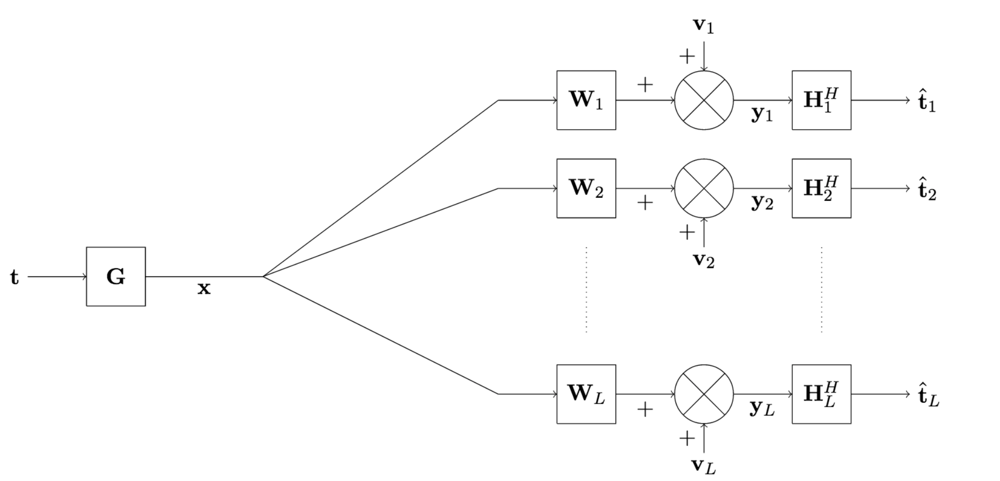

# Fair-Matrix-Design-for-Linear-Video-Coders

## Goal
Master's research project (2018-2019), with the goal of designing fair encoding and decoding matrices for linear video coders (where all image transformations are linear). We use linear coding methods to avoid a sharp decrease in the image reconstruction fidelity when the receiver channel quality (PSNR) is below the threshold for which the coding scheme was designed. We work in a multicast scenario (one source and multiple receivers) :

 

 
## Results

We minimize the greatest reconstruction error among all receiving channels (min-Max optimization), under a power constraint. This is particularly interesting if one sends a message to multiple outputs and wants to make sure that all channels can decode it with high fidelity. 
- For example looking at the PSNR of channel 1 (on the left below), we can see that the PSNR returned by the min-Max solution (in red) is between the PSNR optimized for channel 1 and channel 2 (in blue). 
- We can say the same for the PSNR of channel 2 (on the right), thus, no channel has a PSNR much greater than the other because we distribute the power between both channels.

## References

- M. R. A. Khandaker and Y. Rong, "Precoding Design for MIMO Relay Multicasting," in IEEE Transactions on Wireless Communications, vol. 12, no. 7, pp. 3544-3555, July 2013, doi: 10.1109/TWC.2013.060413.121817.

- Shuo Zheng. Accounting for channel constraints in joint source-channel video coding schemes. Signal and Image Processing. Université Paris-Saclay, 2019. English. ⟨NNT : 2019SACLT005⟩. ⟨tel-02050971⟩.
